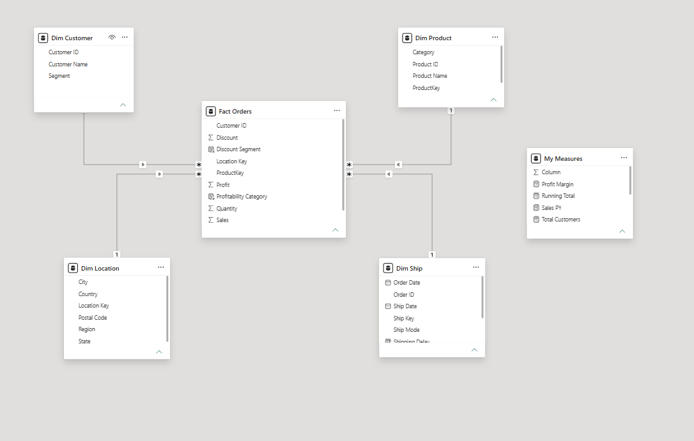

# End-to-End Sales, Logistics, and Executive Performance Analytics

Developed a comprehensive end-to-end Business Intelligence solution using Power BI (`Sample - Superstore 2019.xlsx`) to analyze sales, operational performance, and logistics for a global retail business. This project involved building a robust Star Schema data model and implementing complex DAX measures for deep business insights.

---

## 📋 Project Requirements & Tasks

### Detailed Required Tasks:
* **Data Ingestion:** Import the dataset into Power BI using Power Query.
* **Data Cleaning:** Clean and transform the data using Power Query Editor (handling missing values, formatting columns, and structuring tables).
* **Data Modeling:** Create a proper star schema data model and build clean date hierarchies.
* **DAX Implementation:** Develop advanced DAX measures including Total Sales, Total Profit, Profit Margin %, Running Total, and Year-over-Year (YoY) Growth.
* **Calculated Columns:** Create custom calculated columns such as `Profitability Category` and `Shipping Delay`.
* **Report Pages:** Build interactive analytical report pages for executive analysis, performance tracking, and logistics.
* **Interactivity:** Add slicers, drill-through functionality, and dynamic filtering.

### Technical Specifications:
* Minimum 5 DAX measures implemented.
* Minimum 2 calculated columns.
* Minimum 3 report pages.
* At least 3 interactive visuals.

---

## 🛠️ Part 1: Data Understanding & Preparation (Power Query)
* Connected to `Sample - Superstore 2019.xlsx`.
* Cleaned and transformed raw tables in Power Query Editor to ensure optimal data types and eliminate inconsistencies.

---

## 📐 Part 2: Data Modeling
* Designed and optimized a centralized Star Schema data warehouse.
* Connected `Fact Orders` to core dimension tables (`Dim Customer`, `Dim Product`, `Dim Location`, `Dim Ship`) ensuring high analytical performance and proper relationships.
* Created a dedicated measures table (`My Measures`) for organizing all DAX calculations.

---

## ⚙️ Part 3: DAX & KPI Development
Developed robust measures to track core financial and operational metrics:
* **Total Sales & Total Profit**
* **Profit Margin %**
* **Running Total & YoY Growth**
* **Custom Attributes:** Profitability Category and Shipping Delay calculations.

---

## 🖼️ Part 4: Dashboard Preview & Report Pages

### 1. Executive Overview
High-level KPIs tracking $84M Total Sales, $12M Profit, 5009 Orders, and 52% YoY Growth. Analyzed sales trends by product, region, and segment.

### 2. Executive Performance
Deep dive into monthly Total Profit and Total Sales trends, YoY growth analysis, and profitability by category.

### 3. Logistics & Segment Analysis
Comprehensive tracking of shipping performance, delivery delays, and operational logistics across different customer segments.

---

## 📂 Data Sources & Files
* **Dataset:** `Sample - Superstore 2019.xlsx`
* **Power BI File:** `End-to-End Sales, Logistics, and Executive Performance Analytics.pbix`
*
